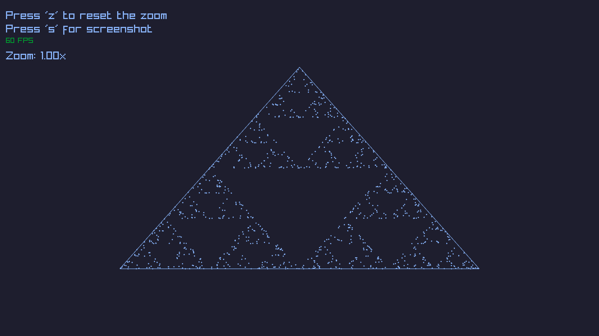

# Sierpinski Triangle



## Quickstart
```sh
gcc -o main main.c -lm -lX11 -lraylib
./main
```

## References
- https://en.wikipedia.org/wiki/Sierpi%C5%84ski_triangle
- https://www.tiktok.com/@bayudshd0w2/video/7615661020102528287?is_from_webapp=1&sender_device=pc&web_id=7609330971217659412

## License
Licensed under the MIT License, see the [LICENSE](./LICENSE) file.
